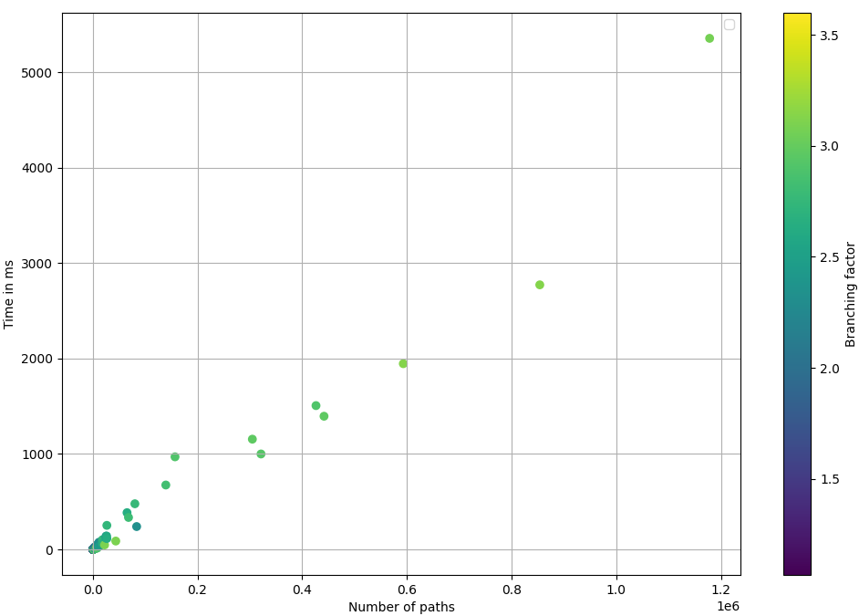
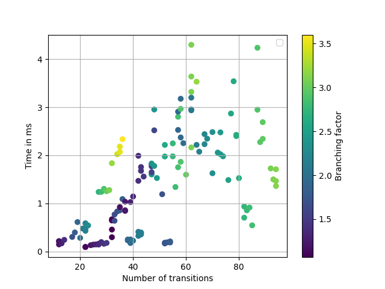
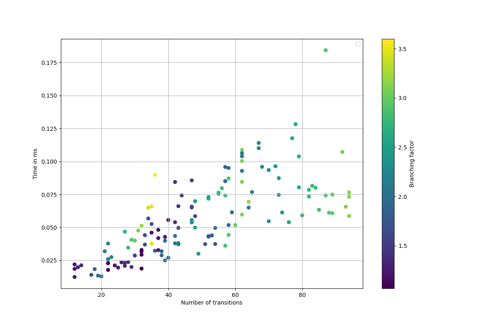
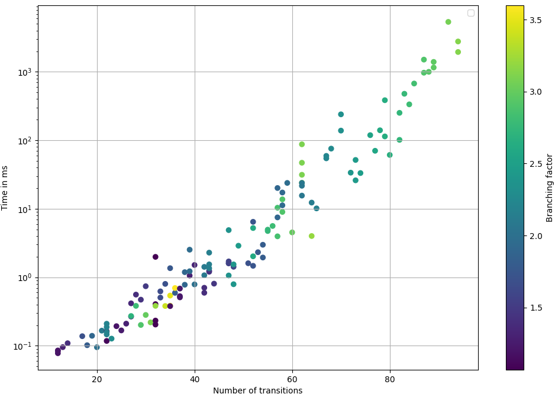

# COORDINATION 2024: Artefact submission for the paper #8


This document specifies the instructions for the AEC of COORDINATION 2024 for the evaluation of our artefact submission. We set a `Docker` container for `TRAC` in order to simplify the work of the AEC (the `README` file at [https://github.com/loctet/TRAC](https://github.com/loctet/TRAC) contains the instructions for the manual installation procedure).


Follow the instructions at
[https://docs.docker.com/](https://docs.docker.com/) to install
`Docker` on your system.
 
To install and run TRAC using `Docker`:

1. Pull the `Docker` image:
   ```bash
   docker pull loctet/trac_dafsms:v1
   ```
2. Run the container:
   ```bash
   docker run -it loctet/trac_dafsms:v1
   ```

The former command downloads the `Docker` image of `TRAC` while the latter starts a container with an interactive terminal.
 
-------------------------------------------------
     ***STEP 1 TAKES A LOT OF TIME. WHY?***
-------------------------------------------------

-------------------------------------------------
     ***Why is this stuff here???***
-------------------------------------------------
## Non Docker Installation Instructions
Before installing `TRAC`, ensure Python 3.6 or later is installed on your system. `TRAC` relies on several Python packages for its operation. Use the following pip commands to install the necessary dependencies:

```bash
pip install z3-solver matplotlib numpy plotly pandas networkx
```
Also make sure the `java JRE` is installed to run the `java` command. This is used to hava a visual view of the DAFSMs.

These commands install the Z3 SMT solver, Matplotlib for plotting, and NumPy for numerical computations, which are essential for `TRAC`'s functionality. Ensure all commands are executed successfully to avoid any issues while running `TRAC`.

-------------------------------------------------
-------------------------------------------------

## Running a Predefined Example: "Simple Market Place"

To run the "simplemarket_place" example with `TRAC`:
1. **Navigate to the `TRAC` Directory**: from the `Docker` container execute ```cd src```.
2. **Locate the Example**: The `simplemarket_place` example taken from [Azure repository](https://github.com/Azure-Samples/blockchain/tree/master/blockchain-workbench/application-and-smart-contract-samples/simple-marketplace) is already within designed examples (`Examples/dafsms_txt/azure`) directory as well as the [other examples](https://github.com/Azure-Samples/blockchain/tree/master/blockchain-workbench/application-and-smart-contract-samples) from the Azure blockchain-workbench:
   - [Hello Blockchain](https://github.com/Azure-Samples/blockchain/blob/master/blockchain-workbench/application-and-smart-contract-samples/hello-blockchain)
   - [Simple Marketplace](https://github.com/Azure-Samples/blockchain/blob/master/blockchain-workbench/application-and-smart-contract-samples/simple-marketplace)
   - [Basic Provenance](https://github.com/Azure-Samples/blockchain/blob/master/blockchain-workbench/application-and-smart-contract-samples/basic-provenance)
   - [Digital Locker](https://github.com/Azure-Samples/blockchain/blob/master/blockchain-workbench/application-and-smart-contract-samples/digital-locker)
   - [Refrigerated Transportation](https://github.com/Azure-Samples/blockchain/blob/master/blockchain-workbench/application-and-smart-contract-samples/refrigerated-transportation)
   - [Asset Transfer](https://github.com/Azure-Samples/blockchain/blob/master/blockchain-workbench/application-and-smart-contract-samples/asset-transfer)
   - [Room Thermostat](https://github.com/Azure-Samples/blockchain/blob/master/blockchain-workbench/application-and-smart-contract-samples/room-thermostat)
   - [Defective Component Counter](https://github.com/Azure-Samples/blockchain/blob/master/blockchain-workbench/application-and-smart-contract-samples/defective-component-counter)
   - [Frequent Flyer Rewards Calculator](https://github.com/Azure-Samples/blockchain/blob/master/blockchain-workbench/application-and-smart-contract-samples/frequent-flyer-rewards-calculator)
   
All manually executed examples should be kept in the folder  `Examples/dafsms_txt` you can create sub-dirs, just be assured to give the exact path to the command `Main.py`.


3. **Execute the Example**:
   - Use `Main.py` to run the example. The command syntax is:
     ```bash
     python3 Main.py --filetype txt "azure/simplemarket_place"
     ```
   - This command tells `TRAC` to process and verify the "simplemarket_place" example.
    The result of this should be `(!) Verdict: Well Formed`
    ____________________
   - The structure of DAFSMs is defined in `section 2 of the paper`.
    For the Simplemarket_place example, here is the structure of the TXT file given
    ```
    _ {True} o:O > starts(c,string _description, int _price) {description := _description & price := _price} {string description, int price, int offer} S0
    S0 {_offer > 0} b:B > c.makeOffer(int _offer) {offer := _offer} S1
    S1 {True} o > c.acceptOffer() {} S2+
    S1 {True} o > c.rejectOffer() {} S01
    S01 {_offer > 0} any b:B > c.makeOffer(int _offer) {offer := _offer} S1
    S01 {_offer > 0} b:B > c.makeOffer(int _offer) {offer := _offer} S1
    ```
    Deploy transition `starts` the coordinator `c` by passing passing a description and a price these values are assigned to declared `string description` and `int price, int offer`. here the precondition(guard `g`) is `True`.This transition also introduce new participant `o` of role `O`
    - ``` _ {True} o:O > starts(c,string _description, int _price) {description := _description & price := _price} {string description, int price, int offer} S0```
    The next transition `S0 {_offer > 0} b:B > c.makeOffer(int _offer) {offer := _offer} S1` allow new participant `b` of role `B` to make and offer by passing a price `_offer` the guard requires `-offer` to be `>0` to update the value of the state variable `offer` and move the protocol to `S1`
    - `S1 {True} o > c.acceptOffer() {} S2+` can be invoke by the previously introduced `o` to accept the offer and move to a final state `S2` it has the sign `+` after
    - `S01 {_offer > 0} any b:B > c.makeOffer(int _offer) {offer := _offer} S1` can be invoke only by any existing participant with role `B`. and `S01 {_offer > 0} b:B > c.makeOffer(int _offer) {offer := _offer} S1` can be invoke only by fresh one. This allow the function `makeOffer` to be available to both `new participant` and `existing ones`
    
   
    - The result of the check should be `(!) Verdict: Well Formed`

4. **Non Well Formed Examples**
   Let's modify the previous simplemarket place to make it not well-formed.
   `S1 {True} o > c.acceptOffer() {} S2+` to `S1 {True} x > c.acceptOffer() {} S2+` now we said x can accept the offer, here, `x` is never introduce and therefore the model DAFSMs should not be well formed.

   After running the check, we have an error:
   ```
   The Path : _-starts-S0>S0-makeOffer-S1 do not contain the participant x : []
   Error from this transitions:S1_acceptOffer()_S2
   --For _acceptOffer_0:   Check result ::  False
   --- Participants       : False

   (!) Verdict: Not Well Formed
   ```
   This tells that the participant `x` has not been introduced.
   __________________
   Let's do another modification:
   `S1 {True} o > c.rejectOffer() {} S01` to `S1 {False} o > c.rejectOffer() {} S01`
   and `S1 {True} o > c.acceptOffer() {} S01` to `S1 {False} o > c.acceptOffer() {} S01`
   Here we are creating DAFSMs where from `S1` there is no possible outgoing transition to progress.
   The Tool should spot this.
   After running the check, we have an error:
   ```
   Error from this transitions:S01_makeOffer(int _offer)_S1
   --For _makeOffer_0:   Check result ::  False
   --- A-Consistency: False

   Simplify of the Not Formula:  Not(And(Not(_offer <= 0), offer == _offer))  ::  True

   (!) Verdict: Not Well Formed
   ```
   This tells that the consistency rule is violated with transition `S01_makeOffer(int _offer)_S1` reaching `S1`

5. **Execute the Example**:
    Now that your first example is completed, you can design some DAFSMs and play around with the command by just changing the name of the file in the previous command (`python3 Main.py --filetype txt "xxxxxxxxx"`)

The `Main.py`, can take some configurations as follows:

   - `file_name`: Specifies the name of the file (JSON or TXT) to process, without its extension. This is the primary input for `TRAC` to analyse.
   - `check_type`: Optional. Defines the type of check to perform on the input file. It can be one of four options:
   - `1` for Well-Formedness Check,
   - `fsm` for printing the Finite State Machine (FSM). The default is `1`.
   - `--filetype`: Optional. Indicates the type of the input file, either `json` or `txt`. The default is `json`.
   - `--non_stop`: Optional. Determines the mode of checking, where `1` (default) continues checking even after errors are found, and `2` stops immediately when an error is detected.
   - `--time_out`: Optional. Sets a timeout for the operation in seconds. The default is `0`, meaning no timeout.
This detailed explanation provides a comprehensive guide on how to utilize `Main.py` for different operations within the `TRAC` tool.

## Generating Examples
To generate DAFSMs examples with `Generate_examples.py`, follow these steps:

1. **Navigate to `TRAC` Directory**: Ensure you're in the root directory of `TRAC`. `src`
2. **Run Generate_examples.py**: Use the command below, adjusting parameters as needed.
   ```bash
   python3 Generate_examples.py --directory your_directory_name --num_tests 100
   ```
   Replace `your_directory_name` with the desired directory to store test files, and adjust `--num_tests` to the number of examples you wish to generate.

   **Generation of examples of the `TRAC` tool paper**
   ```bash
   python3 Generate_examples.py --directory examples_1 --steps 5 --num_example_for_each 5 --num_tests 30 --incremental_gen True
   ```
   This will generate 135 random DAFSMs in the folder `Examples/random_txt/examples_1` with subfolders, each folder having 5 tests and a CSV file(`list_of_files_info.csv`) containing metadata(["path", "num_states", "num_actions", "num_vars", "max_branching_factor", "num_participants", "num_transitions", "seed_num", "min_param_num", "average_param_num", "max_param_num", "min_bf_num", "average_bf_num", "max_bf_num", "num_paths",  "verdict", "participants_time", "non_determinism_time", "a_consistency_time", "f_building_time", "building_time", "z3_running_time", "total", "is_time_out"]
   ) of those 5 examples. All these csv are then combined into a main csv `list_of_files_info.csv`
   This will then run the check and further csv files will be generated and merged (to `merged_list_of_files_info`) when done.
   **Now you can plot the data to visualize different running time**
   ```
   python3 ./plot_data.py examples_1 --file merged_list_of_files_info --field num_states,num_transitions,num_paths --pl_lines participants_time,non_determinism_time,a_consistency_time,z3_running_time --shape 2d --type_plot scatter
   ```
   This will plot these plots
   |   |   |
   |---|---|
   | | |
   | |   |


3. **Parameters**:
    The parameters for `Generate_examples.py` enable customization of the DAFSMs example generation process. If not specified, values for these parameters are generated randomly:
    - `--directory`: Specifies the directory to save generated examples.
    - `--num_tests`: The number of tests to generate.
    - `--num_states`: The number of states per test.
    - `--num_actions`: The number of actions.
    - `--num_vars`: The number of variables.
    - `--max_num_transitions`: The maximum number of transitions.
    - `--max_branching_factor`: The maximum branching factor.
    - `--num_participants`: The number of participants.
    - `--incremental_gen`: Enables incremental generation.
    - `--merge_only_csv`: Merges results into a single CSV without generating new tests.
    - `--steps`: The increment steps for generating tests.
    - `--num_example_for_each`: The number of examples to generate for each configuration.

4. **Output**: Examples are created in a subdirectory within `Examples/random_txt`. A CSV at the root of this directory contains metadata for each generated example, including paths, number of states, actions, variables, branching factors, and timings.

This process allows for the automated generation and analysis of DAFSMs examples, facilitating comprehensive testing and verification of DAFSMs with `TRAC`.

## Running Sets of Examples

   To execute multiple examples with `Random_exec.py`, the command format and parameters are as follows:
   ```bash
   python3 Random_exec.py --directory <subdir> --merge_csv --add_path --number_test_per_cpu <num> --number_runs_per_each <runs> --time_out <nanoseconds>
   ```
   - `--directory`: Specifies a subdirectory in `Examples/random_txt` where the examples and `list_of_files_info.csv` are located.
   - `--merge_csv`: Merges individual CSV results into `merged_list_of_files_info.csv`.
   - `--add_path`: Just count the number_path to each test in the CSV.
   - `--number_test_per_cpu`: Determines how many tests are run in parallel per CPU.
   - `--number_runs_per_each`: Specifies how many times to run each test.
   - `--time_out`: Sets a timeout limit for each test.

   The process splits tests for parallel execution, outputs results to CSV files, and merges them upon completion. Results are stored in a subdirectory within `Examples/random_txt/<subdir>` to preserve data. Execution time varies with the test suite size.

## Plotting Results

   To plot results using `Plot_data.py`, follow these command-line instructions, customizing them based on your needs:

   ```bash
   python3 Plot_data.py <directory> --shape <shape> --file <file_name> --fields <fields_to_plot> --pl_lines <lines_to_plot> --type_plot <plot_type>
   ```

   - `<directory>`: The directory where the test data CSV is located, relative to `./examples/random_txt/` where the `merged_list_of_files_info.csv` is.
   - `--shape`: Choose the plot shape: `2d`, `3d`, or `4d`.
   - `--file`: Specify the CSV file name without the extension, defaulting to `merged_list_of_files_info`.
   - `--fields`: Set the column(s) to plot against time, default is `num_states`.
   - `--pl_lines`: Define which time metric to plot, with defaults including participants time, non-determinism time and a-consistency-time.
   - `--type_plot`: Choose the type of 2D plot, with `line`  (values `line`, `scatter`, `bar`)as the default.


   This command allows for versatile plotting configurations, adjusting for different dimensions and aspects of the data captured in the CSV file. All plots are saved in the directory directly.

## Main functions

   
   - [Validator](https://github.com/loctet/TRAC/blob/main/src/The_Validator.py)
   - [TrGrinder](https://github.com/loctet/TRAC/blob/main/src/TransactionsGrinder.py)
   - [CallerCheck](https://github.com/loctet/TRAC/blob/main/src/FSMGraph.py#L86)
   - [NDetCheck](https://github.com/loctet/TRAC/blob/main/src/TransitionProcessor.py#L132)
   - [AConsitency](https://github.com/loctet/TRAC/blob/main/src/TransitionProcessor.py#L109)
   - [FBuilder](https://github.com/loctet/TRAC/blob/main/src/Fbuilder.py)
   - [Z3Runner](https://github.com/loctet/TRAC/blob/main/src/Z3Runner.py#L13)
   - [Analyzer](https://github.com/loctet/TRAC/blob/main/src/Z3Runner.py#L43)
______________________________
   - [Generate Examples](https://github.com/loctet/TRAC/blob/main/src/Generate_examples.py#L397)
   - [Run randoms examples](https://github.com/loctet/TRAC/blob/main/src/Random_exec.py)
   - [Plot example](https://github.com/loctet/TRAC/blob/main/src/Plot_data.py)
   - [Defualt Settings](https://github.com/loctet/TRAC/blob/main/src/Settings.py)

   **The full documentation in HTML format can be found locally in the sub-dir `docs`**


## Reminder
   All commands provided, such as running tests, generating examples, executing multiple examples, and plotting results with various scripts like `Main.py`, `Generate_examples.py`, `Random_exec.py`, and `Plot_data.py`, come equipped with a `--help` option. Utilizing `--help` will display detailed usage instructions and available options for each command, aiding users in understanding and effectively utilizing the tool's features.
