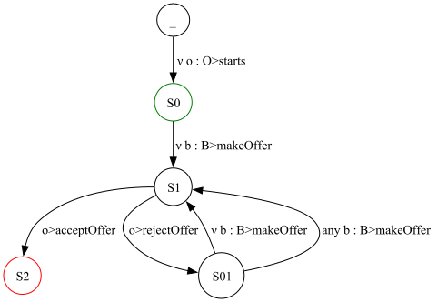

# Data-aware coordination with `TRAC`

## Artefact submission for the COORDINATION 2024 paper #8<span style="-typora-class: textPaperPage;"> </span>

<span style="-typora-class: authors;">Joao Afonso, Elvis Konjoh Selabi, Maurizio Murgia, Antonio Ravara, and Emilio Tuosto</span>

This document specifies the instructions for the AEC of COORDINATION 2024 for the evaluation of our artefact submission. We set a `Docker` container for `TRAC` in order to simplify the work of the AEC (the `README` file at [https://github.com/loctet/TRAC](https://github.com/loctet/TRAC) contains the instructions for the manual installation procedure).

References to our paper submitted at COORDINATION 2024 are marked with a <span style="-typora-class: textPaperPage;"> </span>.

[TOC]


# 1. Installation

Follow the instructions at [https://docs.docker.com/](https://docs.docker.com/) to install `Docker` on your system.

To install and run TRAC using `Docker`:

1. Pull the `Docker` image:
   ```bash
   docker pull loctet/trac_dafsms:v1
   ```
2. Run the container:
   ```bash
   docker run -it loctet/trac_dafsms:v1
   ```
   (you might need to run the above commands as `root`). The former command downloads the `Docker` image of `TRAC` while the latter starts a container with an interactive terminal.


# 2. Reproducibility

## 2.1 How Table 1 has been created
We want to highlight the fact that we spotted some errors in Table 1<span style="-typora-class: textPaperPage;"> </span>  and the table in this section contains updated information for `Simple Marketplace, Defective Component Counter, Frequent Flyer Rewards Calculator, and Asset Transfer`.

We now describe how the information has been determined. 
We recall that Table 1<span style="-typora-class: textPaperPage;"> </span> reports how our framework captures the features of the smart contracts in the Azure repository described at the following links:

- [Hello Blockchain](https://github.com/Azure-Samples/blockchain/blob/master/blockchain-workbench/application-and-smart-contract-samples/hello-blockchain)
- [Simple Marketplace](https://github.com/Azure-Samples/blockchain/blob/master/blockchain-workbench/application-and-smart-contract-samples/simple-marketplace)
- [Basic Provenance](https://github.com/Azure-Samples/blockchain/blob/master/blockchain-workbench/application-and-smart-contract-samples/basic-provenance)
- [Digital Locker](https://github.com/Azure-Samples/blockchain/blob/master/blockchain-workbench/application-and-smart-contract-samples/digital-locker)
- [Refrigerated Transportation](https://github.com/Azure-Samples/blockchain/blob/master/blockchain-workbench/application-and-smart-contract-samples/refrigerated-transportation)
- [Asset Transfer](https://github.com/Azure-Samples/blockchain/blob/master/blockchain-workbench/application-and-smart-contract-samples/asset-transfer)
- [Room Thermostat](https://github.com/Azure-Samples/blockchain/blob/master/blockchain-workbench/application-and-smart-contract-samples/room-thermostat)
- [Defective Component Counter](https://github.com/Azure-Samples/blockchain/blob/master/blockchain-workbench/application-and-smart-contract-samples/defective-component-counter)
- [Frequent Flyer Rewards Calculator](https://github.com/Azure-Samples/blockchain/blob/master/blockchain-workbench/application-and-smart-contract-samples/frequent-flyer-rewards-calculator).

For each smart contract, the table below reports
- where the features are met in the `Solidity` implementation in the Azure repository
- the lines in the DAFSM model where the feature is captured (if at all) 

Features `RR` and `MRP`  are not explicitly handled by `TRAC` and therefore not present in the column `How TRAC handles it` in the table below.


|Example (link to .sol )| Line in Code for the feature | How TRAC handles it |
|---|---|---|
|[Simple Marketplace](https://github.com/Azure-Samples/blockchain/blob/master/blockchain-workbench/application-and-smart-contract-samples/simple-marketplace/ethereum/SimpleMarketplace.sol)|BI :  Lines 21, 44<br/>RR: Line 60|BI:  [Line 1, 2, 6](https://github.com/loctet/TRAC/blob/main/src/Examples/dafsm_txt/azure/simplemarket_place.txt#L2) |
|[Hello Blockchain](https://github.com/Azure-Samples/blockchain/blob/master/blockchain-workbench/application-and-smart-contract-samples/hello-blockchain/HelloBlockchain.sol)|BI:  Lines 19, 39|BI:  [Line 1, 3](https://github.com/loctet/TRAC/blob/main/src/Examples/dafsm_txt/azure/hello_blockchain.txt) |
|[Bazaar](https://github.com/Azure-Samples/blockchain/blob/master/blockchain-workbench/application-and-smart-contract-samples/bazaar-item-listing/ethereum/BazaarItemListing.zip)|ICI:  BazaarItem (Line 78) ItemList(Line 40) <br/>BI :  BazaarItem (Line 76) ItemList(Line 33)| |
|[Ping Pong](https://github.com/Azure-Samples/blockchain/blob/master/blockchain-workbench/application-and-smart-contract-samples/ping-pong-game/ethereum/PingPongGame.sol) |BI :  Line 16, 67<br/>ICI :  Lines 18, 29, 41, 47, 77, 82, 88| |
|[Defective Component Counter](https://github.com/Azure-Samples/blockchain/blob/master/blockchain-workbench/application-and-smart-contract-samples/defective-component-counter/ethereum/DefectiveComponentCounter.sol)| BI:  Line 17<br>PP: Line 15 |BI: [Line 1](https://github.com/loctet/TRAC/blob/main/src/Examples/dafsm_txt/azure/defective_component_counter.txt)<br/>PP: [Line 1](https://github.com/loctet/TRAC/blob/main/src/Examples/dafsm_txt/azure/defective_component_counter.txt) |
|[Frequent Flyer Rewards Calculator](https://github.com/Azure-Samples/blockchain/blob/master/blockchain-workbench/application-and-smart-contract-samples/frequent-flyer-rewards-calculator/ethereum/FrequentFlyerRewardsCalculator.sol)| BI :  Line 20 <br/>PP :  Line 18 |BI:  [Line 1](https://github.com/loctet/TRAC/blob/main/src/Examples/dafsm_txt/azure/frequent_flyer_rewards_calculator.txt)<br/>PP:  [Line 1](https://github.com/loctet/TRAC/blob/main/src/Examples/dafsm_txt/azure/frequent_flyer_rewards_calculator.txt) |
|[Room Thermostat](https://github.com/Azure-Samples/blockchain/blob/master/blockchain-workbench/application-and-smart-contract-samples/room-thermostat/ethereum/RoomThermostat.sol)| PP :  Line 16 |PP:  [Line 1](https://github.com/loctet/TRAC/blob/main/src/Examples/dafsm_txt/azure/room_thermostat.txt) |
|[Asset Transfer](https://github.com/Azure-Samples/blockchain/blob/master/blockchain-workbench/application-and-smart-contract-samples/asset-transfer/ethereum/AssetTransfer.sol)| BI :  Line 18, <br/>PP: Line 49<br/>RR :  Lines 97, 171 |BI:  [Lines 1, 3](https://github.com/loctet/TRAC/blob/main/src/Examples/dafsm_txt/azure/asset_transfer.txt)<br/>PP: [Lines 2, 7](https://github.com/loctet/TRAC/blob/main/src/Examples/dafsm_txt/azure/asset_transfer.txt) |
|[Basic Provenance](https://github.com/Azure-Samples/blockchain/blob/master/blockchain-workbench/application-and-smart-contract-samples/basic-provenance/ethereum/BasicProvenance.sol)| BI:  Line 19 <br/>PP:  Line 17, 26 <br/>RR :  Line 38, 51 |BI:  [Line 1](https://github.com/loctet/TRAC/blob/main/src/Examples/dafsm_txt/azure/basic_provenance.txt)<br/>PP:  [Line 1, 2, 3](https://github.com/loctet/TRAC/blob/main/src/Examples/dafsm_txt/azure/basic_provenance.txt) |
|[Refrigerated Transportation](https://github.com/Azure-Samples/blockchain/blob/master/blockchain-workbench/application-and-smart-contract-samples/refrigerated-transportation/ethereum/RefrigeratedTransportation.sol)| BI:  Line 32 <br/>PP:  Line 28, 89 <br/>RR :  Line 118, 143 <br/>MRP :  Lines 33, 34, 119,142 |BI:  [Line 1](https://github.com/loctet/TRAC/blob/main/src/Examples/dafsm_txt/azure/refrigirated_transport.txt)<br/>PP:  [Line 1, 5 , 9](https://github.com/loctet/TRAC/blob/main/src/Examples/dafsm_txt/azure/refrigirated_transport.txt) |
|[Digital Locker](https://github.com/Azure-Samples/blockchain/blob/master/blockchain-workbench/application-and-smart-contract-samples/digital-locker/ethereum/DigitalLocker.sol)| BI :  Line 21 <br/>PP:  Lines 19, 68 <br/>RR :  Lines 102,126, 127, 139, 149 <br/>MRP :  Lines 76, 91 |BI: [Line 1](https://github.com/loctet/TRAC/blob/main/src/Examples/dafsm_txt/azure/digital_locker.txt)<br/>PP: [Line 1](https://github.com/loctet/TRAC/blob/main/src/Examples/dafsm_txt/azure/digital_locker.txt) |

## 2.2. How to check the well-formedness of the Azure benchmarks

The DAFSM models for each smart contract but for `Bazaar` and `Ping Pong` of the Azure repository can be found in the directory `src/Examples/dafsms_txt/azure`.

To check a model with `TRAC`, navigate to the directory `src` and execute the `Main.py` as done in the `Docker`  with commands below on the  [`Simple Marketplace`](https://github.com/Azure-Samples/blockchain/tree/master/blockchain-workbench/application-and-smart-contract-samples/simple-marketplace) smart contract:
   ```bash
   cd src
   python3 Main.py --filetype txt "azure/simplemarket_place"
   ```
The latter command produces the following output
   ```tex
--Parsing Txt to generate Json file

Checking the well formness of the model----

(!) Verdict: Well Formed
   ```
reporting that the DAFSMs for the `azure/simplemarket_place` is well formed. For the other smart contracts it is enough to execute the python script on the corresponding DAFSM.


## 2.3. How to check the randomly generated models 

The 135 randomly generated models used in the last part of Section 4 <span style="-typora-class: textPaperPage;"> </span> are in `src/Examples/random_txt/tests_dafsm_1` splitted in sub-directories each containing 5 DAFSMs and a `list_of_files_info.csv` file with metadata on the DAFSMs (we detail the metadata in [section 4 below](#4-documentation)). Our performance analysis can be reproduced by executing the following commands in the `Docker`:

   ```bash
   cd src
   python3 Random_exec.py tests_dafsms_1 --number_runs_per_each 10\
   	--number_test_per_cpu 5 --time_out 300000000000  
   ```
Note that the results may vary due to different hardware/software configurations than those we used (cf. page 12<span style="-typora-class: textPaperPage;"> </span>).
The latter command above specifies the target directory `tests_dafsms_1`, the number of repetitions for each experiment, the number of experiments analyzed by each cpu, and the time out in nanoseconds. While running the checks further `csv` files will be generated and finally merged into a single file called `src/Examples/random_txt/tests_dafsm_1/merged_list_of_files_info.csv`.

<span style="-typora-class: textRed;">**Warning**:</span> 
Notice if the target directory in the command above is not changed, this `csv` file will be overwritten at each execution. The current content of the `csv` files when starting the `Docker` contains the values plotted in Figures 2 and 3<span style="-typora-class: textPaperPage;"> </span>.

The plots can be obtained by executing 
```bash
python3 ./plot_data.py examples_1 --file merged_list_of_files_info\
	--field num_states,num_transitions,num_paths\
	--pl_lines participants_time,non_determinism_time,a_consistency_time,z3_running_time\
    --shape 2d --type_plot scatter
```
in the `Docker`; the plots are `png` images saved in the directory `src/Examples/random_txt/tests_dafsms_1`.


# 3. Usage

## 3.1. Format of DAFSMs
The DAFSMs model (Definition 1 <span style="-typora-class: textPaperPage;"> </span>) is renderer in `TRAC` with a DSL which represents a DAFSM as sequences of lines, each specifying a transition of the DAFSM. We explain the format of transitions through the Simple Marketplace contract (following Example 1<span style="-typora-class: textPaperPage;"> </span>), which in our DSL is

```
_ {True} o:O > starts(c,string _description, int _price) \
         {description := _description & price := _price} \
         {string description, int price, int offer} S0
S0 {_offer > 0} b:B > c.makeOffer(int _offer) {offer := _offer} S1
S1 {True} o > c.acceptOffer() {} S2+
S1 {True} o > c.rejectOffer() {} S01
S01 {_offer > 0} any b:B > c.makeOffer(int _offer) {offer := _offer} S1
S01 {_offer > 0} b:B > c.makeOffer(int _offer) {offer := _offer} S1
```


hereafter called `SMP`; the names of states in `SMP` differ from those in Example 1, but this is immaterial for the analysis.


In general, a transition consists of

   - a source and a target state; a trailing `+` denotes final states (like `S2+` above)
   - a guard specified in the notation of `Z3`
   - a qualified participant `p : P` corresponding to <em><i>&#x3BD;</i></em> p : P, `any p : P`, or just `p`  (Definition 1<span style="-typora-class: textPaperPage;"> </span>)
   - a call to an operation of the contract
   - a list of `&`-separate assignments.

The first line of `SMP` is a special transition corresponding to the edge entering the initial state in Example 1 barred for

- the fact that the source state is `_` is used to identify the initial state
- the additional `_description` parameter, omitted in the paper for readability

The guard `True` in the transition is the *precondition* while the list of assignments `{description := _description & price := _price}` is followed by an explicit declaration of the contract variables to capture the assumption in the first item of Page 3 <span style="-typora-class: textPaperPage;"> </span>; the transition introduces a fresh participant `o` with role `O` which renders the object-oriented mechanism described just above Definition 1<span style="-typora-class: textPaperPage;"> </span>.

Conventionally, parameters start with `_` to distinguish them from contract variables. 

## 3.2. Examples of non well-formed models
As seen in [section 2.2](#22-how-to-check-the-well-formedness-of-the-azure-benchmarks), `SMP` is well-formed; we now apply `TRAC` to detect non-well-formed models. The file `azure/simplemarket_place_edit_1` contains a modified DAFSM obtained by replacing the `acceptOffer` transition of `SMP` with

<pre style="-typora-class: transitionLL;">S1 {True} x > c.acceptOffer() {} S2+</pre> 


Executing in the `Docker`

```bash
python3 Main.py --filetype txt "azure/simplemarket_place_edit_1"
```

produces

```
The Path : _-starts-S0>S0-makeOffer-S1 does not contain the participant x : []
Error from this stage:S1_acceptOffer()_S2
--For _acceptOffer_0:   Check result ::  False
--- Participants       : False

(!) Verdict: Not Well Formed
```

stating that participant `x` has not been introduced. In fact, the `CallerCheck` finds a path to `S1` where  participant `x` is not introduced (first line of the output above) identified in the transition from `S1` to `S2` with label `acceptOffer` (second line of the output). The last three lines of the output inform the user that well formedness does not hold for the use of a non introduced participant.

The file `azure/simplemarket_place_edit_2` modifies `SMP` by replacing the transitions `acceptOffer` and `rejectOffer` respectively with

<span style="-typora-class: transitionL;">S1 {False} o > c.acceptOffer() {} S01</span> and <span style="-typora-class: transitionL;">S1 {False} o > c.rejectOffer() {} S01</span> 

Executing now the command below in the `Docker` 

```bash
python3 Main.py --filetype txt "azure/simplemarket_place_edit_2"
```

produces

```
Error from this state:S01_makeOffer(int _offer)_S1
--For _makeOffer_0:   Check result ::  False
--- A-Consistency: False

Simplification of the of the negation of the formula:  Not(And(Not(_offer <= 0), offer == _offer))  ::  True
   
(!) Verdict: Not Well Formed
```
which tells that consistency is violated by the transition 

```
S0 {_offer > 0} b:B > c.makeOffer(int _offer) {offer := _offer} S1
```

The simplification operated by `Z3` on the negation of the formula in the last but one line of the output yields (the formula) `True`.

The `Main.py` script used above accepts the `check_type <chk>` optional parameters where `<chk>` can take two qualifiers; `check_type` defaults to `1` which checks well-formedness and can be set to `fsm` to generate a visual representation of a DAFSM as a `png` file.

The image below for `SMP` is generated by invoking the `GraphStream` library ([https://graphstream-project.org/](https://graphstream-project.org/)) from our `GraphGen` component according to Figure 1 <span style="-typora-class: textPaperPage;"> </span>



(labels are simplified for readability). The description in Section 3.1 <span style="-typora-class: textPaperPage;"> </span> wrongly states that `GraphGen` is "a third-party component", but in fact it should read that `GraphGen` is a wrapper to invoke `GraphStream`. Unfortunately, the image cannot be visualised from inside the `Docker` because `GraphGen` uses the functionality of `GraphStream` that displays the graph in an interactive window. So, to see the model it is necessary to use `TRAC` from outside the `Docker`.


## 3.3. Commands for performance evaluation
To evaluate the performances of `TRAC`, we created a randomizer that contains a generator of random models in our DSL, a program that applies `TRAC` on the generated models, and a visualiser to plot data from `csv` files. In the following, we explain how to perform each step.

The following command generates 100 random models, saves them in the directory `src/Examples/random_txt/your_sub_dir_name`, checks for the well-formedness of the models, and collects performance data in `csv` files:

```bash
python3 Generate_examples.py --directory your_sub_dir_name --num_tests 100
```

The generation process can be customised setting optional parameters of `Generate_examples.py`; if not specified, all but the last four parameters default to randomly generated values:
- `--num_tests <num>` the number of tests to generate
- `--num_states <num>` the number of states per test
- `--num_actions <num>` is the number of actions
- `--num_vars <num>` is the number of variables
- `--max_num_transitions <num>` is the maximal number of transitions that should be at least the number of states (minus 1) 
- `--max_branching_factor <num>` is the maximum branching factor that should be greater or equal to 1; in corner cases, the branching factor is predominant and may lead to exceeding the maximum number of transitions
- `--num_participants <num>` is the maximum number of participant variables
- `--steps <num>` the increment steps for generating tests (meaningful only if `--incremental_gen` below is set to true; default: `10`)
- `--incremental_gen [True|False]` enables/disables incremental generation of models (default: `False`)
- `--merge_only_csv [True|False]` if set to `True` merges results into a single `csv` file; all other parameters are ignored when this is flag is used (default: `False`)
- `--num_example_for_each <num>` is the number of models to generate for each configuration (default:`5`).

To generate the models used in Section 4 <span style="-typora-class: textPaperPage;"> </span>, we ran the following command:

```bash 
python3 Generate_examples.py --directory tests_dafsms_1 --steps 5\
	--num_example_for_each 5 --num_tests 30 --incremental_gen True
```
<span style="-typora-class: textRed;">**Warning**:</span> 

The directory `src/Examples/random_txt/tests_dafsms_1` in the `Docker` is populated with the models and `csv` files generated for the experiments reported in the paper<span style="-typora-class: textPaperPage;"> </span>. Executing the command above in the `Docker` would overwrite the files generated for the experiments in Section 4 <span style="-typora-class: textPaperPage;"> </span>.

Well-formedness check of the models starts immediately after the generation phase is completed. The results of each check are stored in a `csv` file together with metadata for the performance evaluation. (The full description of the metadata is in [section 4 below](#4-documentation).)


It is possible to check existing generated models stored in `src/Examples/random_txt/<subdir>` with the following command

```bash
python3 Random_exec.py <subdir> --number_test_per_cpu 5\
	--number_runs_per_each 10 --time_out 300000000000
```
where 

   - `--number_test_per_cpu <num>` determines how many tests are to run in parallel per CPU (default: `5`)
   - `--number_runs_per_each <num>` specifies how many times to run each model check (default: `10`)
   - `--time_out <num>` sets a timeout limit to perform each model check (default: `300000000000`).

The command above reads the metadata in `src/Examples/random_txt/<subdir>/list_of_files_info.csv`, allocates 5 models to each CPU and performs the check as described in Section 4<span style="-typora-class: textPaperPage;"> </span>. Each CPU will output a `csv` file `src/Examples/random_txt/<subdir>/list_of_files_info_<id>.csv` for each set of models'  `<id>` assigned to the CPU. All `csv` files are merged into the file `src/Examples/random_txt/<subdir>/merged_list_of_files_info.csv` upon completion of the evaluation.

The checking process can be customized by setting the following optional parameters:

   - `--merge_csv [True|False]` if set to `True`, merges THE generated `csv` files into `src/Examples/random_txt/<subdir>/merged_list_of_files_info.csv` (default: `False`)
   - `--add_path [True|False]` if set to `True`, counts the number path for each model in the `src/Examples/random_txt/<subdir>/list_of_files_info.csv` (default: `False`)

To preserve data `Random_exec.py` stores results in `src/Examples/random_txt/<subdir>/<time>` where `<time>` is the time when the execution started.


Data are plotted using `Plot_data.py`

```bash
python3 Plot_data.py <directory> --shape <shape> \
	[--file <file_name>] [--fields <fields_to_plot>]\
	[--pl_lines <lines_to_plot>] [--type_plot <plot_type>]
```
where
   - `<directory>` is the sub-directory of `src/Examples/random_txt/<subdir>/` containing the `csv` files
   - `--shape [2d|3d]` sets the plot shape
   - `--file <str>` specify the name of the `csv` file (without the extension) (default: `merged_list_of_files_info`)
   - `--fields <list>` sets the column(s) in the `csv` file to plot (default: `num_states`)
   - `--pl_lines <list>` defines a comma-separated list of performance indicators to plot against the list set in `--fields` (default: `participants_time, non-determinism_time, a-consistency-time`)
   - `--type_plot [line|scatter|bar]` chooses the type of 2D plot (default: `line`)
   - `--scale [log|linear]` scale of the y-axis (default: `log`).

To generate the plots of Section 4<span style="-typora-class: textPaperPage;"> </span>, we ran the following commands:

```bash
python3 Plot_data.py tests_dafsms_1 --file merged_list_of_files_info\
	--field num_states,num_transitions,num_paths\
	--pl_lines participants_time,non_determinism_time,a_consistency_time\
    --shape 2d --type_plot scatter --scale linear

python3 Plot_data.py tests_dafsms_1 --file merged_list_of_files_info\
	--field num_states,num_transitions,num_paths\
	--pl_lines participants_time,non_determinism_time,a_consistency_time\
    --shape 2d --type_plot scatter --scale log
```

All generated plots are stored in the directory `src/Examples/random_txt/test_dafsms_1/`. To visualise these plots it is necessary to copy them to a directory outside of `Docker` executing the following commands from a non-docker shell:
```bash
docker ps  
docker cp <containerID>:/home/TRAC/src/Examples/random_txt/<directory> <localPath>
```
where `containerID` is the `Docker` identity of the `loctet/trac_dafsms:v1` image returned by the `docker ps` command, `<localPath>` is the path outside `Docker` where plots should be copied.


## 3.4. Run your own examples
Designing some DAFSM and checking them can be done by executing the `Main.py` on the file where the DAFSM is stored.

By default, the model should be stored `src/Examples/dafsms_txt`. 

Further models can be found in `src/Examples/other_tests`.

Settings of `TRAC` can be configured in the file `src/Settings.py`. This includes default directories where models are stored and default values of parameters for `TRAC's`commands. For more detailed information about these settings, refer to the [full documentation](#4-further-information).

# 4. Further information

Below is the description of the header of the `csv` files:
   - `path` the path to the model file
   - `num_states` number of states 
   - `num_actions` number of actions
   - `num_vars` number of variables
   - `max_branching_factor` maximum branching factor
   - `num_participants` number of participants
   - `num_transitions` number of transitions
   - `seed_num` seed number used for randomization
   - `min_param_num` actual minimum number of parameters
   - `average_param_num` actual average number of parameters
   - `max_param_num` actual maximum number of parameters
   - `min_bf_num` actual minimum number of branching factors
   - `average_bf_num` actual average number of branching factors
   - `max_bf_num` actual maximum number of branching factors
   - `num_paths` number of paths
   - `verdict` verdict of the verification process
   - `participants_time` time taken for checking participants
   - `non_determinism_time` time taken for non-determinism check
   - `a_consistency_time` time taken for action consistency check
   - `f_building_time` time taken for formula building
   - `building_time` time taken for building
   - `z3_running_time` time taken for running Z3
   - `total` total time taken for the process
   - `is_time_out` indicates if there was a timeout during processing.


The complete documentation of `TRAC` includes detailed code explanations and usage instructions. After downloading, unzip the file to access the Sphinx-generated documentation. This documentation is available at [GitHub repository](https://github.com/loctet/TRAC/tree/main/docs/trac-html-doc.zip) and provides further insights on features of `TRAC`.

Commands  `Main.py`, `Generate_examples.py`, `Random_exec.py`, and `Plot_data.py` feature a `--help` option, e.g.,
```bash
   python3 Main.py --help
```

 prints a description of the available options and the usage of `Main.py`.
